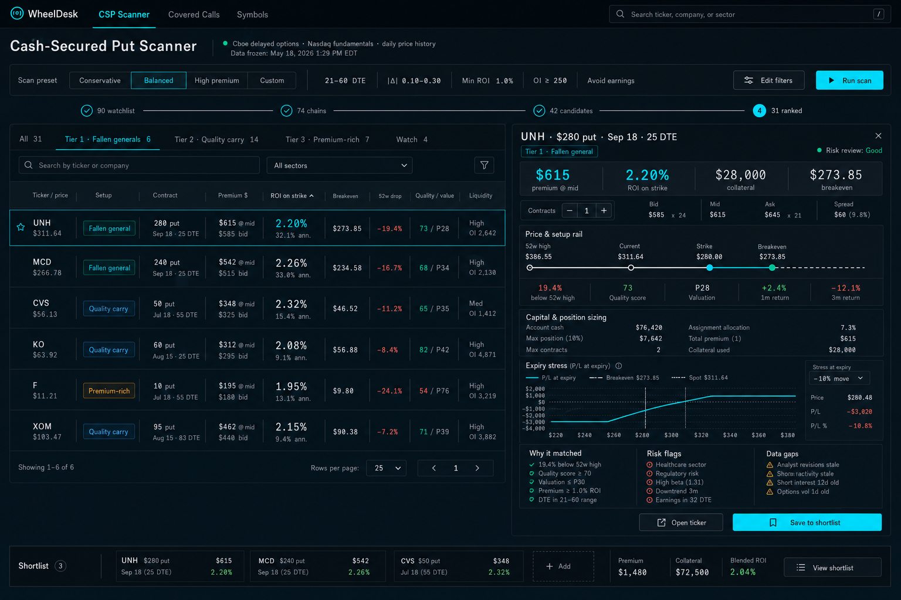
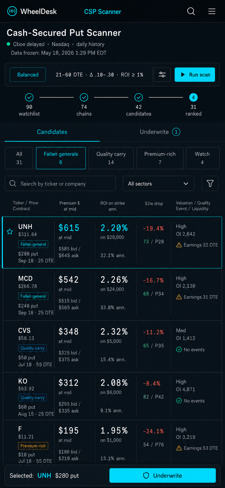
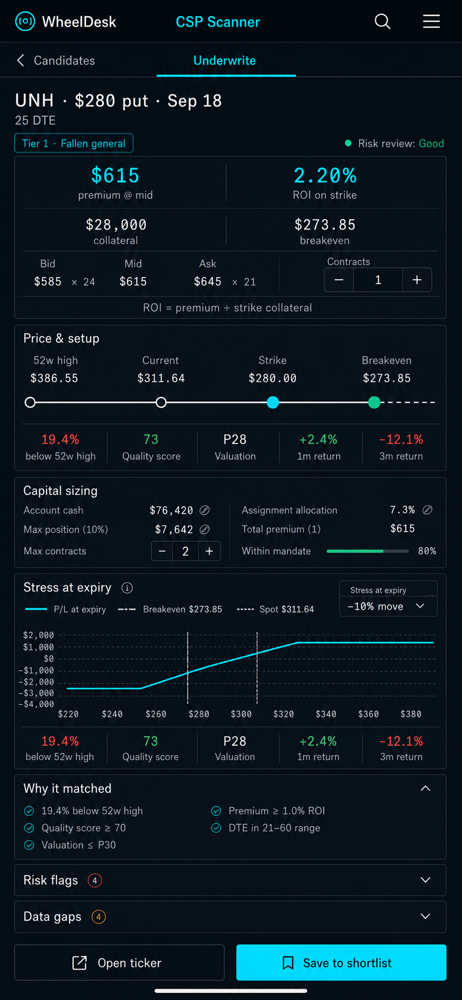

# WheelDesk Pro

A personal, installable options-underwriting terminal for cash-secured puts and covered
calls across a curated universe of liquid US stocks and ETFs, with a per-ticker
workbench. Browser-local settings; no database or brokerage connection.

Production: [wheeldeskpro.vercel.app](https://wheeldeskpro.vercel.app)

## Features

- **Unified Decision Desk** — a ranked mandate-survivor matrix and persistent
  contract inspector combine economics, capital permission, expected-move
  stress, evidence gaps, ticker research, and a locally saved desk shortlist
- **Deterministic CSP tiers** — fallen generals, quality carry, high ROI, and
  watch buckets make distinct setups comparable without hiding risk flags
- **Watchlist tiers** — 113 names from the IBKR watchlist carry their
  `VORTEX_WATCHLIST.md` tier. The put scan covers Tier 1A by default; including
  the other tiers shows them risk-flagged with the doctrine reason. The
  covered-call scan covers every tier. A Tier 1A name is scored only against
  Tier 1A peers, so its score does not move when the wider list loads. The
  app holds no position data, so covered-call strikes are **not** checked
  against an assignment floor; every call row says so
- **Measured base rates** — beside model P(ITM), the inspector shows how often a
  strike the same IV30-sigma distance out historically finished beyond (and
  touched) the strike, and, when earnings fall in the window, the measured
  two-day ±10% move rate across S&P 500 releases
- **Dollar-first economics** — bid-floor and midpoint premium dollars sit next
  to period ROI on strike, required collateral, breakeven, and quantity sizing
- **CSP + covered-call underwriters** — delayed chains with vendor greeks/IV,
  P(ITM), ROC + annualized, IV/RV (displayed, not scored), buffer, spread, OI,
  and explicit event gaps
- **Assignment research** — current market-cap valuation against sector peers,
  quality and leverage factors, a transparent four-pillar composite, and no
  neutral score when reported company data is missing
- **Explicit mandate controls** — contract, assignment, execution, and event
  constraints are independently adjustable; VIX is context, not a hidden tuner
- **Ticker workbench** (`/ticker/AAPL`) — put/call strike ladders in the delta
  band, annualized yield curve by strike, 6-month price with candidate strikes,
  30-day realized vol vs current IV
- **Shareable scans** — filters encoded in the URL; CSV export; last-used filters
  persisted in localStorage
- **Progressive scanning** — the universe is scanned in cursor batches that
  stream into the table
- **Installable PWA** — standalone launch, branded regular and maskable icons,
  shortcut entries, a network-first shell, and an explicit offline state; live
  quote and option-chain APIs are never cached

## Tiered CSP Decision Desk workflow

The screener now keeps the deep research model and makes the next decision
explicit:

1. Choose a conservative, balanced, or high-premium preset, then adjust any
   hard contract gate if needed.
2. Run the progressive universe scan and narrow the survivors by setup tier.
3. Compare premium dollars, ROI on strike, breakeven, 52-week drawdown, quality,
   peer valuation, and liquidity in one matrix.
4. Select a contract and size it against a locally stored account-capital rule.
5. Stress expiry P/L by a chosen multiple of the underlying expected move.
6. Inspect why the setup matched, what invalidates it, and what evidence is
   still missing.
7. Save the contract to a local desk shortlist or open the full ticker
   workbench. No order is transmitted.

The capital settings and shortlist are browser-local, versioned state. They do
not change the server-side score and are never sent to a brokerage.

Desktop and mobile implementation specs:







The exact tier thresholds, economics formulas, and visual rules are recorded in
[`docs/csp-scanner-tiered-spec.md`](docs/csp-scanner-tiered-spec.md).

## Brand

The mark is a W made of two interlocking V's, the put leg and the covered-call
leg. The diamond where they cross is the strike, the only cyan in the mark.
Geometry lives in `lib/brand-geometry.ts`. `node scripts/make-icons.mjs`
regenerates the favicon, app icons, maskable icon, SVGs, and
`docs/brand/wheeldeskpro-mark.png` from that geometry. Favicons use a heavier
cut so they stay legible at 16px.

## Data

Runs keyless on public delayed option data, daily history, and current market
capitalizations with TTM company factors derived from the latest four reported
quarters. Optional environment variables upgrade it:

| Variable | Effect |
| --- | --- |
| `APCA_API_KEY_ID` / `APCA_API_SECRET_KEY` | Real-time spot prices; Alpaca chain path on ticker pages |
| `FMP_API_KEY` | Earnings and ex-dividend event flags |

Missing evidence is surfaced as a data gap and reduces confidence; missing
fundamentals never receive a neutral valuation score. P(ITM) is a Black-Scholes
model value computed from each contract's IV and labeled as such.

Base-rate tables are offline measurements checked into `lib/data`, never
estimated at request time:

- `lib/data/historical-breach.json` is generated by
  `claude-code/vrp-timing/breach_table.py`. It covers 16 underlyings with a Cboe
  30-day IV index, 2011–2026, at 14–60 DTE, with single names restricted to
  earnings-free windows. It reproduces that study's 11.0% finish rate for a −1σ,
  30-day put. SLV is excluded from the per-symbol rates, because its IV index is
  missing 2022-02 to 2025-05, but it stays in the pooled rate.
- The earnings tail rate is 19,513 S&P 500 releases (2016–2026). It uses the
  two-day announcement-window return in excess of SPY.

## Stack

Next.js (App Router) · React · TypeScript strict · Tailwind CSS 4 · Recharts ·
lucide-react. All market-data fetching is server-side; keys never reach the client.

## Develop

```bash
npm install
npm run dev    # http://localhost:3000
npm run lint
npm run build
```

Copy `.env.example` to `.env.local` for the optional keys.

## Deploy

Push to GitHub, import in Vercel, add the optional env vars in project settings.
The app works with zero configuration.

---

Educational tooling, not investment advice. VCG Research · Compiled from public
market data.
